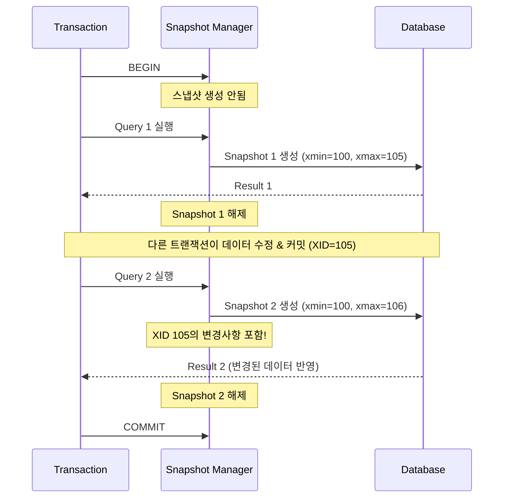
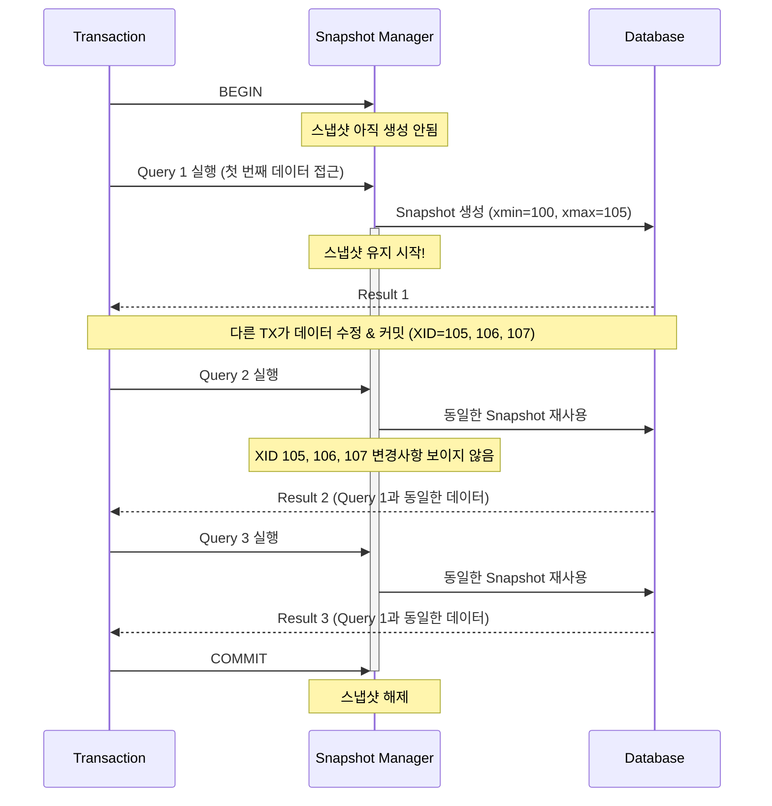

# PostgreSQL 트랜잭션 격리 수준별 스냅샷과 가시성

## 목차
1. [소개](#소개)
2. [Read Committed](#1-read-committed-기본-격리-수준)
3. [Repeatable Read](#2-repeatable-read)
4. [Serializable](#3-serializable)
5. [격리 수준 비교표](#4-격리-수준-비교표)
6. [스냅샷 내부 구조](#5-스냅샷-내부-구조)
7. [실전 동시성 시나리오](#6-실전-동시성-시나리오)
8. [성능 고려사항](#7-성능-고려사항)
9. [FAQ](#8-faq)

---

## 소개

### 트랜잭션 격리 수준이란?
트랜잭션 격리 수준(Transaction Isolation Level)은 동시에 실행되는 여러 트랜잭션 간의 데이터 가시성과 간섭을 제어하는 메커니즘입니다. 격리 수준이 높을수록 데이터 일관성은 향상되지만, 동시성 성능은 저하될 수 있습니다.

### PostgreSQL이 지원하는 격리 수준
PostgreSQL은 SQL 표준의 4가지 격리 수준 중 실질적으로 3가지를 지원합니다:

1. **Read Committed** (기본값) - 가장 낮은 격리 수준
2. **Repeatable Read** - 중간 격리 수준
3. **Serializable** - 가장 높은 격리 수준

> **참고**: PostgreSQL은 Read Uncommitted를 지원하지 않으며, 이를 설정하면 자동으로 Read Committed로 처리됩니다.

### 스냅샷의 역할
**스냅샷(Snapshot)**은 특정 시점의 데이터베이스 상태를 나타내는 논리적인 뷰입니다. PostgreSQL의 MVCC(Multi-Version Concurrency Control)에서 스냅샷은 다음을 결정합니다:

- 어떤 튜플 버전이 현재 트랜잭션에 "보이는지"
- 다른 트랜잭션의 변경사항을 언제 볼 수 있는지
- 트랜잭션의 격리 수준이 어떻게 동작하는지

**핵심 차이점**: 격리 수준에 따라 스냅샷이 **언제, 얼마나 자주** 생성되는지가 달라집니다.

---

## 1. Read Committed (기본 격리 수준)

### 스냅샷 생성 시점
**각 SQL 문장(쿼리)이 시작될 때마다 새로운 스냅샷이 생성됩니다.**

- `BEGIN` 시점: 스냅샷이 생성되지 않음
- 첫 번째 `SELECT`: 스냅샷 1 생성
- 두 번째 `UPDATE`: 스냅샷 2 생성
- 세 번째 `SELECT`: 스냅샷 3 생성

### 가시성 규칙

1. **커밋된 데이터만 보임**: 각 쿼리는 해당 쿼리가 시작되는 시점에 이미 커밋된 데이터만 볼 수 있습니다.
2. **Non-repeatable Read 발생 가능**: 같은 트랜잭션 내에서도 동일한 쿼리가 다른 결과를 반환할 수 있습니다.
3. **Phantom Read 발생 가능**: 범위 쿼리 시 새로운 행이 추가되거나 삭제될 수 있습니다.

### 스냅샷 생애주기 다이어그램




### 실용적인 예시

```sql
-- 트랜잭션 1 (Read Committed)
BEGIN;  -- 스냅샷이 아직 생성되지 않음

-- 첫 번째 쿼리 실행 시 스냅샷 1 생성
SELECT balance FROM accounts WHERE id = 1;
-- 결과: 1000

-- 이 시점에 다른 트랜잭션(TX2)이 실행됨:
-- TX2: UPDATE accounts SET balance = 500 WHERE id = 1;
-- TX2: COMMIT;

-- 두 번째 쿼리 실행 시 스냅샷 2 생성 (새로운 스냅샷!)
SELECT balance FROM accounts WHERE id = 1;
-- 결과: 500 (TX2의 변경사항이 보임!)

COMMIT;
```

### 동시성 시나리오: Lost Update 문제

Read Committed에서 발생할 수 있는 전형적인 문제:

```sql
-- 시나리오: 두 직원이 동시에 재고를 감소시킴

-- TX1 (직원 A)
BEGIN;
SELECT stock FROM products WHERE id = 1;  -- 100개
-- ... 계산 중 ...
UPDATE products SET stock = 100 - 10 WHERE id = 1;  -- 90개로 설정

-- TX2 (직원 B) - TX1이 COMMIT하기 전에 시작
BEGIN;
SELECT stock FROM products WHERE id = 1;  -- 여전히 100개 (TX1 아직 커밋 안됨)
-- ... 계산 중 ...
-- TX1이 이제 COMMIT함 (stock = 90)
UPDATE products SET stock = 100 - 5 WHERE id = 1;  -- 95개로 설정 (잘못된 결과!)

COMMIT;

-- 최종 결과: 95개 (올바른 결과는 85개여야 함)
-- 직원 A의 변경사항이 손실됨 (Lost Update)
```

### 특징 요약

| 특성 | 설명 |
|------|------|
| **스냅샷 수명** | 각 SQL 문장이 실행되는 동안만 유지 |
| **스냅샷 개수** | 트랜잭션 내 실행된 쿼리 수만큼 생성 |
| **최신성** | 가장 최신의 커밋된 데이터를 볼 수 있음 |
| **일관성** | 트랜잭션 내에서 동일 쿼리가 다른 결과 반환 가능 |
| **성능** | 가장 높은 동시성, 낮은 오버헤드 |

---

## 2. Repeatable Read

### 스냅샷 생성 시점
**트랜잭션 내 첫 번째 쿼리(데이터 접근 문장)가 실행될 때 단 한 번만 생성되며, 트랜잭션이 종료될 때까지 유지됩니다.**

- `BEGIN` 시점: 스냅샷이 생성되지 않음
- 첫 번째 `SELECT`: 스냅샷 생성 ✓
- 두 번째 `UPDATE`: 동일한 스냅샷 사용
- 세 번째 `SELECT`: 동일한 스냅샷 사용

### 가시성 규칙

1. **일관된 스냅샷**: 트랜잭션 전체에서 동일한 시점의 데이터를 봅니다.
2. **Repeatable Read 보장**: 동일한 쿼리를 여러 번 실행해도 항상 같은 결과를 반환합니다.
3. **Phantom Read 방지**: PostgreSQL의 Repeatable Read는 SQL 표준보다 강력하여 Phantom Read도 방지합니다.
4. **자신의 변경사항은 보임**: 현재 트랜잭션이 수행한 변경사항은 즉시 보입니다.

### 스냅샷 생애주기 다이어그램



### 실용적인 예시

```sql
-- 트랜잭션 1 (Repeatable Read)
BEGIN;
SET TRANSACTION ISOLATION LEVEL REPEATABLE READ;

-- 첫 번째 쿼리 실행 시 스냅샷 생성
SELECT balance FROM accounts WHERE id = 1;
-- 결과: 1000

-- 이 시점에 다른 트랜잭션(TX2)이 실행됨:
-- TX2: UPDATE accounts SET balance = 500 WHERE id = 1;
-- TX2: COMMIT;

-- 두 번째 쿼리는 동일한 스냅샷 사용
SELECT balance FROM accounts WHERE id = 1;
-- 결과: 1000 (TX2의 변경사항이 보이지 않음!)

-- 세 번째 쿼리도 동일한 스냅샷 사용
SELECT balance FROM accounts WHERE id = 1;
-- 결과: 1000 (여전히 동일)

COMMIT;

-- COMMIT 후 새 트랜잭션에서 조회하면:
BEGIN;
SELECT balance FROM accounts WHERE id = 1;
-- 결과: 500 (이제 TX2의 변경사항이 보임)
COMMIT;
```

### Repeatable Read의 UPDATE 동작

Repeatable Read에서 UPDATE를 실행할 때 흥미로운 동작이 발생합니다:

```sql
-- TX1 (Repeatable Read)
BEGIN;
SET TRANSACTION ISOLATION LEVEL REPEATABLE READ;

SELECT balance FROM accounts WHERE id = 1;  -- 스냅샷 생성, 결과: 1000

-- TX2가 먼저 업데이트하고 커밋
-- TX2: UPDATE accounts SET balance = 500 WHERE id = 1; COMMIT;

-- TX1에서 UPDATE 시도
UPDATE accounts SET balance = balance - 100 WHERE id = 1;
-- PostgreSQL은 TX2의 변경사항을 기다립니다 (TX2가 이미 커밋됨)
-- UPDATE 실행: balance = 500 - 100 = 400

SELECT balance FROM accounts WHERE id = 1;
-- 결과: 400 (자신의 변경사항은 보임)

COMMIT;
```

**중요**: UPDATE/DELETE는 최신 버전의 행을 기준으로 작동하지만, SELECT는 여전히 스냅샷을 사용합니다.

### Write Skew 문제

Repeatable Read에서 발생할 수 있는 동시성 이상 현상:

```sql
-- 시나리오: 두 의사가 동시에 당직에서 빠지려고 함
-- 제약조건: 최소 1명의 의사가 당직이어야 함

-- 초기 상태: doctor_id=1 (on_duty=true), doctor_id=2 (on_duty=true)

-- TX1 (의사 1)
BEGIN;
SET TRANSACTION ISOLATION LEVEL REPEATABLE READ;
SELECT COUNT(*) FROM doctors WHERE on_duty = true;  -- 2명
-- 2명이므로 안전하게 빠질 수 있다고 판단
UPDATE doctors SET on_duty = false WHERE doctor_id = 1;

-- TX2 (의사 2) - TX1과 동시에 실행
BEGIN;
SET TRANSACTION ISOLATION LEVEL REPEATABLE READ;
SELECT COUNT(*) FROM doctors WHERE on_duty = true;  -- 2명
-- 2명이므로 안전하게 빠질 수 있다고 판단
UPDATE doctors SET on_duty = false WHERE doctor_id = 2;

-- 두 트랜잭션 모두 COMMIT
COMMIT;  -- TX1
COMMIT;  -- TX2

-- 최종 결과: 당직 의사가 0명! (제약조건 위반)
```

**해결책**: Serializable 격리 수준을 사용하거나, 명시적 잠금(`SELECT FOR UPDATE`)을 사용해야 합니다.

### 특징 요약

| 특성 | 설명 |
|------|------|
| **스냅샷 수명** | 트랜잭션 시작부터 종료까지 유지 |
| **스냅샷 개수** | 트랜잭션당 1개 |
| **최신성** | 트랜잭션 시작 시점의 커밋된 데이터만 보임 |
| **일관성** | 트랜잭션 내에서 항상 동일한 결과 보장 |
| **성능** | 중간 수준의 오버헤드 |

---

## 3. Serializable

### 스냅샷 생성 시점
**Repeatable Read와 동일**: 트랜잭션 내 첫 번째 쿼리가 실행될 때 단 한 번만 생성됩니다.

### 가시성 규칙
**Repeatable Read와 동일한 가시성 규칙을 가집니다.**

### 차이점: SSI (Serializable Snapshot Isolation)
Serializable의 핵심은 **스냅샷 격리에 추가로 직렬화 충돌 감지 메커니즘**을 제공한다는 점입니다:

1. **Read-Write 의존성 추적**: 트랜잭션 간의 읽기-쓰기 의존성을 추적합니다.
2. **의존성 그래프 분석**: 사이클이 형성되면 직렬화 불가능한 상태를 감지합니다.
3. **선제적 충돌 감지**: 실제 문제가 발생하기 전에 잠재적인 직렬화 위반을 감지합니다.
4. **트랜잭션 중단**: 충돌이 감지되면 `SERIALIZATION FAILURE` 오류를 발생시키고 트랜잭션을 중단합니다.

### 스냅샷 생애주기 + SSI 다이어그램

```mermaid
sequenceDiagram
    participant TX as Transaction
    participant Snap as Snapshot Manager
    participant SSI as SSI Checker
    participant DB as Database

    TX->>Snap: BEGIN
    TX->>Snap: Query 1 실행
    Snap->>DB: Snapshot 생성 (xmin=100, xmax=105)
    activate Snap
    SSI->>DB: Read 의존성 추적 시작
    activate SSI
    DB-->>TX: Result 1

    Note over TX,DB: 다른 TX가 읽은 데이터를 수정 시도

    SSI->>SSI: 의존성 그래프 분석
    Note over SSI: Read-Write 충돌 감지

    TX->>Snap: Query 2 실행
    Snap->>DB: 동일한 Snapshot 재사용

    alt 직렬화 충돌 감지됨
        SSI-->>TX: ERROR: could not serialize access
        TX->>DB: ROLLBACK (강제)
        deactivate SSI
        deactivate Snap
    else 직렬화 가능
        TX->>Snap: COMMIT
        SSI->>DB: 의존성 추적 종료
        deactivate SSI
        deactivate Snap
    end
```

### 실용적인 예시: Write Skew 방지

```sql
-- 동일한 의사 당직 시나리오를 Serializable로 해결

-- TX1 (의사 1)
BEGIN;
SET TRANSACTION ISOLATION LEVEL SERIALIZABLE;
SELECT COUNT(*) FROM doctors WHERE on_duty = true;  -- 2명
UPDATE doctors SET on_duty = false WHERE doctor_id = 1;
-- COMMIT 시도...

-- TX2 (의사 2)
BEGIN;
SET TRANSACTION ISOLATION LEVEL SERIALIZABLE;
SELECT COUNT(*) FROM doctors WHERE on_duty = true;  -- 2명
UPDATE doctors SET on_duty = false WHERE doctor_id = 2;
COMMIT;  -- 성공

-- TX1이 COMMIT 시도
COMMIT;
-- ERROR: could not serialize access due to read/write dependencies among transactions
-- DETAIL: Reason code: Canceled on identification as a pivot, during commit attempt.
-- HINT: The transaction might succeed if retried.

-- 결과: TX1이 자동으로 중단되어 제약조건이 보호됨!
```

### SSI 작동 원리

Serializable은 다음 세 가지 의존성을 추적합니다:

1. **rw-conflict (읽기-쓰기 충돌)**: TX1이 읽은 데이터를 TX2가 수정
2. **wr-conflict (쓰기-읽기 충돌)**: TX1이 쓴 데이터를 TX2가 읽음
3. **ww-conflict (쓰기-쓰기 충돌)**: TX1과 TX2가 동일한 데이터를 수정

**Dangerous Structure**: 세 개의 동시 트랜잭션 T1, T2, T3가 있을 때:
- T3 → T1 (rw-conflict)
- T1 → T2 (rw-conflict)
- T2 → T3 (rw-conflict)

이러한 사이클이 형성되면 직렬화 불가능하므로, 하나의 트랜잭션이 중단됩니다.

### 재시도 패턴

Serializable을 사용할 때는 항상 재시도 로직이 필요합니다:

```python
import psycopg2

def execute_with_retry(conn, max_retries=3):
    for attempt in range(max_retries):
        try:
            with conn.cursor() as cur:
                cur.execute("SET TRANSACTION ISOLATION LEVEL SERIALIZABLE")
                cur.execute("SELECT COUNT(*) FROM doctors WHERE on_duty = true")
                count = cur.fetchone()[0]

                if count > 1:
                    cur.execute("UPDATE doctors SET on_duty = false WHERE doctor_id = 1")
                    conn.commit()
                    return True
                else:
                    conn.rollback()
                    return False

        except psycopg2.extensions.TransactionRollbackError as e:
            # Serialization failure - 재시도
            conn.rollback()
            if attempt == max_retries - 1:
                raise
            continue
```

### 특징 요약

| 특성 | 설명 |
|------|------|
| **스냅샷 수명** | 트랜잭션 시작부터 종료까지 유지 (RR과 동일) |
| **스냅샷 개수** | 트랜잭션당 1개 (RR과 동일) |
| **가시성** | Repeatable Read와 동일 |
| **추가 보장** | 직렬화 이상 현상 방지 (Write Skew 등) |
| **성능** | 가장 높은 오버헤드, 트랜잭션 재시도 필요 |

---

## 4. 격리 수준 비교표

### 기본 비교

| 격리 수준 | 스냅샷 생성 시점 | 스냅샷 개수 | 스냅샷 수명 |
|----------|----------------|------------|-----------|
| **Read Committed** | 각 SQL 문장 시작 시 | 여러 개 | 문장 실행 동안만 |
| **Repeatable Read** | 첫 번째 쿼리 실행 시 | 1개 | 트랜잭션 전체 |
| **Serializable** | 첫 번째 쿼리 실행 시 | 1개 | 트랜잭션 전체 |

### 동시성 이상 현상 방지

| 이상 현상 | Read Committed | Repeatable Read | Serializable |
|----------|----------------|-----------------|--------------|
| **Dirty Read** (커밋되지 않은 데이터 읽기) | ✅ 방지 | ✅ 방지 | ✅ 방지 |
| **Non-repeatable Read** (동일 쿼리 다른 결과) | ❌ 발생 가능 | ✅ 방지 | ✅ 방지 |
| **Phantom Read** (범위 쿼리 시 행 추가/삭제) | ❌ 발생 가능 | ✅ 방지* | ✅ 방지 |
| **Serialization Anomaly** (Write Skew 등) | ❌ 발생 가능 | ❌ 발생 가능 | ✅ 방지 |

*PostgreSQL의 Repeatable Read는 SQL 표준보다 강력하여 Phantom Read도 방지합니다.

### 성능 vs 일관성 트레이드오프

| 격리 수준 | 동시성 성능 | CPU 오버헤드 | 메모리 사용 | 트랜잭션 재시도 |
|----------|-----------|------------|-----------|--------------|
| **Read Committed** | 🟢 최고 | 🟢 최저 | 🟢 최저 | ❌ 불필요 |
| **Repeatable Read** | 🟡 중간 | 🟡 중간 | 🟡 중간 | ❌ 불필요 (일반적) |
| **Serializable** | 🔴 최저 | 🔴 최고 | 🔴 최고 | ✅ 필요 |

---

## 5. 스냅샷 내부 구조

### 스냅샷이 포함하는 정보

PostgreSQL의 스냅샷은 다음 세 가지 핵심 정보를 포함합니다:

```c
typedef struct SnapshotData {
    TransactionId xmin;   /* 활성 트랜잭션 중 가장 오래된 XID */
    TransactionId xmax;   /* 다음에 할당될 XID (활성 범위의 상한) */
    TransactionId *xip;   /* 진행 중인 트랜잭션 ID 배열 */
    uint32 xcnt;          /* xip 배열의 크기 */
    // ... 기타 필드들
} SnapshotData;
```

#### 필드 설명

1. **`xmin`**: 스냅샷 생성 시점에 활성화된 트랜잭션 중 가장 작은(오래된) XID
   - `xmin` 미만의 모든 트랜잭션은 이미 완료됨 (커밋 또는 롤백)

2. **`xmax`**: 스냅샷 생성 시점의 다음 트랜잭션 ID
   - `xmax` 이상의 모든 트랜잭션은 아직 시작되지 않음

3. **`xip[]`**: 스냅샷 생성 시점에 진행 중인 트랜잭션 ID 목록
   - 시작되었지만 아직 커밋되지 않은 트랜잭션들

### 스냅샷 예시

```
현재 시점에 활성화된 트랜잭션: 100, 102, 105
다음 할당될 XID: 107

생성된 스냅샷:
xmin = 100
xmax = 107
xip  = [100, 102, 105]
```

### 가시성 판단 알고리즘

튜플이 현재 스냅샷에서 보이려면 다음 조건을 모두 만족해야 합니다:

```
1. 튜플을 삽입한 트랜잭션 (xmin) 확인:
   - tuple.xmin < snapshot.xmin
     → xmin이 스냅샷보다 훨씬 이전에 커밋됨 (보임)

   - tuple.xmin >= snapshot.xmax
     → xmin이 스냅샷 이후에 시작됨 (보이지 않음)

   - snapshot.xmin <= tuple.xmin < snapshot.xmax
     → tuple.xmin이 xip[]에 있는지 확인:
       - IN xip[] → 아직 진행 중 (보이지 않음)
       - NOT IN xip[] → 이미 커밋됨 (보임)

2. 튜플을 삭제한 트랜잭션 (xmax) 확인:
   - tuple.xmax = 0
     → 삭제되지 않음 (보임)

   - tuple.xmax >= snapshot.xmax
     → 스냅샷 이후에 삭제됨 (보임)

   - tuple.xmax < snapshot.xmin
     → 스냅샷 이전에 삭제됨 (보이지 않음)

   - snapshot.xmin <= tuple.xmax < snapshot.xmax
     → tuple.xmax가 xip[]에 있는지 확인:
       - IN xip[] → 삭제 진행 중 (보임)
       - NOT IN xip[] → 이미 삭제됨 (보이지 않음)
```

### 구체적인 예시

```sql
-- 초기 상태
-- accounts 테이블: id=1, balance=1000 (xmin=99, xmax=0)

-- TX 100 시작
BEGIN;  -- XID=100

-- TX 101 시작
BEGIN;  -- XID=101
UPDATE accounts SET balance = 500 WHERE id = 1;
-- 새로운 튜플 생성: (xmin=101, xmax=0)
-- 기존 튜플 수정: (xmin=99, xmax=101)

-- TX 102 시작 (Repeatable Read)
BEGIN;
SET TRANSACTION ISOLATION LEVEL REPEATABLE READ;

-- TX 102의 첫 번째 쿼리 → 스냅샷 생성
SELECT balance FROM accounts WHERE id = 1;

-- 이 시점의 스냅샷:
-- xmin = 100 (가장 오래된 활성 트랜잭션)
-- xmax = 103 (다음 할당될 XID)
-- xip  = [100, 101] (진행 중인 트랜잭션들)

-- 가시성 판단:
-- 튜플 1 (xmin=99, xmax=101):
--   - xmin=99 < snapshot.xmin=100 → 커밋됨
--   - xmax=101 IN snapshot.xip → 삭제 진행 중 (아직 커밋 안됨)
--   → 결과: 보임 (balance=1000)

-- 튜플 2 (xmin=101, xmax=0):
--   - xmin=101 IN snapshot.xip → 삽입 진행 중
--   → 결과: 보이지 않음
```

### 스냅샷 메모리 오버헤드

- 일반적으로 스냅샷은 매우 작은 메모리를 사용합니다 (수십~수백 바이트)
- `xip[]` 배열의 크기는 동시 실행 트랜잭션 수에 비례
- 대부분의 시스템에서 무시할 수 있는 수준

---

## 6. 실전 동시성 시나리오

동일한 시나리오를 세 가지 격리 수준에서 비교해봅시다.

### 시나리오: 계좌 잔액 조회 및 수정

**초기 상태**: `accounts` 테이블에 `id=1, balance=1000`

#### 시나리오 1: Read Committed

```
시간 | TX1 (Read Committed)              | TX2 (Read Committed)
-----|-----------------------------------|------------------------------------
T0   | BEGIN;                            |
T1   | SELECT balance FROM accounts      |
     | WHERE id = 1;                     |
     | -- 결과: 1000 (스냅샷 1 생성)        |
     |                                   |
T2   |                                   | BEGIN;
T3   |                                   | UPDATE accounts
     |                                   | SET balance = 500 WHERE id = 1;
T4   |                                   | COMMIT; ✓
     |                                   |
T5   | SELECT balance FROM accounts      |
     | WHERE id = 1;                     |
     | -- 결과: 500 (스냅샷 2 생성)          |
     | -- TX2의 변경사항이 보임!            |
     |                                   |
T6   | UPDATE accounts                   |
     | SET balance = balance - 100       |
     | WHERE id = 1;                     |
     | -- balance = 500 - 100 = 400      |
     |                                   |
T7   | COMMIT; ✓                         |
```

**결과**: 최종 balance = 400
**특징**: TX1이 TX2의 변경사항을 즉시 볼 수 있음 (Non-repeatable Read 발생)

---

#### 시나리오 2: Repeatable Read

```
시간 | TX1 (Repeatable Read)             | TX2 (Repeatable Read)
-----|-----------------------------------|------------------------------------
T0   | BEGIN;                            |
     | SET TRANSACTION ISOLATION LEVEL   |
     | REPEATABLE READ;                  |
     |                                   |
T1   | SELECT balance FROM accounts      |
     | WHERE id = 1;                     |
     | -- 결과: 1000 (스냅샷 생성!)         |
     |                                   |
T2   |                                   | BEGIN;
     |                                   | SET TRANSACTION ISOLATION LEVEL
     |                                   | REPEATABLE READ;
T3   |                                   | UPDATE accounts
     |                                   | SET balance = 500 WHERE id = 1;
T4   |                                   | COMMIT; ✓
     |                                   |
T5   | SELECT balance FROM accounts      |
     | WHERE id = 1;                     |
     | -- 결과: 1000 (동일한 스냅샷 사용)    |
     | -- TX2의 변경사항이 보이지 않음!      |
     |                                   |
T6   | UPDATE accounts                   |
     | SET balance = balance - 100       |
     | WHERE id = 1;                     |
     | -- ⚠️ 여기서 흥미로운 일이 발생!      |
     | -- UPDATE는 최신 버전 기준으로 동작   |
     | -- balance = 500 - 100 = 400      |
     |                                   |
T7   | COMMIT; ✓                         |
```

**결과**: 최종 balance = 400
**특징**: SELECT는 일관된 스냅샷을 보지만, UPDATE/DELETE는 최신 커밋된 버전을 기준으로 동작

---

#### 시나리오 3: Serializable

```
시간 | TX1 (Serializable)                | TX2 (Serializable)
-----|-----------------------------------|------------------------------------
T0   | BEGIN;                            |
     | SET TRANSACTION ISOLATION LEVEL   |
     | SERIALIZABLE;                     |
     |                                   |
T1   | SELECT balance FROM accounts      |
     | WHERE id = 1;                     |
     | -- 결과: 1000 (스냅샷 생성)          |
     | -- SSI: TX1이 id=1 행을 읽음 기록    |
     |                                   |
T2   |                                   | BEGIN;
     |                                   | SET TRANSACTION ISOLATION LEVEL
     |                                   | SERIALIZABLE;
T3   |                                   | UPDATE accounts
     |                                   | SET balance = 500 WHERE id = 1;
     |                                   | -- SSI: TX2가 id=1 행을 수정 기록
     |                                   | -- 의존성: TX1 → TX2 (rw-conflict)
T4   |                                   | COMMIT; ✓
     |                                   |
T5   | UPDATE accounts                   |
     | SET balance = balance - 100       |
     | WHERE id = 1;                     |
     | -- SSI: TX1이 id=1 행을 수정       |
     | -- 의존성: TX2 → TX1 (wr-conflict) |
     |                                   |
T6   | COMMIT;                           |
     | -- ❌ ERROR!                       |
     | -- could not serialize access due |
     | -- to read/write dependencies     |
     | -- 사이클 감지: TX1 → TX2 → TX1    |
```

**결과**: TX1이 실패하고 ROLLBACK됨
**특징**: Write Skew와 같은 직렬화 이상을 감지하여 방지

---

### 시나리오 비교: Write Skew

**상황**: 은행 규칙 - 부부 공동 계좌의 합계 잔액이 최소 $100 이상이어야 함

**초기 상태**:
- Account A (남편): $150
- Account B (아내): $150
- 합계: $300

#### Read Committed / Repeatable Read

```
시간 | TX1 (남편)                        | TX2 (아내)
-----|----------------------------------|----------------------------------
T1   | BEGIN;                           |
T2   | SELECT SUM(balance)              |
     | FROM accounts;                   |
     | -- 결과: 300 (충분함)              |
     |                                  |
T3   |                                  | BEGIN;
T4   |                                  | SELECT SUM(balance)
     |                                  | FROM accounts;
     |                                  | -- 결과: 300 (충분함)
     |                                  |
T5   | UPDATE accounts                  |
     | SET balance = balance - 200      |
     | WHERE account = 'A';             |
     | -- A: $150 → -$50                |
     |                                  |
T6   |                                  | UPDATE accounts
     |                                  | SET balance = balance - 200
     |                                  | WHERE account = 'B';
     |                                  | -- B: $150 → -$50
     |                                  |
T7   | COMMIT; ✓                        |
T8   |                                  | COMMIT; ✓

-- 최종 상태: A=-$50, B=-$50, 합계=-$100
-- ❌ 제약조건 위반! (최소 $100 필요)
```

#### Serializable

```
시간 | TX1 (남편)                        | TX2 (아내)
-----|----------------------------------|----------------------------------
T1   | BEGIN;                           |
     | SET TRANSACTION ISOLATION LEVEL  |
     | SERIALIZABLE;                    |
T2   | SELECT SUM(balance)              |
     | FROM accounts;                   |
     | -- 결과: 300                      |
     | -- SSI: TX1이 A, B 행을 읽음      |
     |                                  |
T3   |                                  | BEGIN;
     |                                  | SET TRANSACTION ISOLATION LEVEL
     |                                  | SERIALIZABLE;
T4   |                                  | SELECT SUM(balance)
     |                                  | FROM accounts;
     |                                  | -- 결과: 300
     |                                  | -- SSI: TX2가 A, B 행을 읽음
     |                                  |
T5   | UPDATE accounts                  |
     | SET balance = balance - 200      |
     | WHERE account = 'A';             |
     | -- SSI: TX1이 A를 수정            |
     |                                  |
T6   |                                  | UPDATE accounts
     |                                  | SET balance = balance - 200
     |                                  | WHERE account = 'B';
     |                                  | -- SSI: TX2가 B를 수정
     |                                  |
T7   | COMMIT; ✓                        |
T8   |                                  | COMMIT;
     |                                  | -- ❌ ERROR!
     |                                  | -- Serialization failure
     |                                  | -- 자동 ROLLBACK

-- 최종 상태: A=-$50, B=$150, 합계=$100
-- ✓ 제약조건 유지! TX2가 재시도 필요
```

---

## 7. 성능 고려사항

### 격리 수준별 성능 특성

#### Read Committed
- **장점**:
  - 최소한의 오버헤드
  - 스냅샷이 짧은 시간만 유지되므로 메모리 효율적
  - 트랜잭션 간 대기 시간 최소화
  - Dead tuple 정리가 빠름 (스냅샷이 오래 유지되지 않음)

- **단점**:
  - 애플리케이션에서 일관성을 보장하기 어려움
  - Lost Update, Non-repeatable Read 등을 수동으로 처리해야 함

- **적합한 경우**:
  - 단순한 읽기 작업
  - 단일 쿼리로 완결되는 작업
  - 최신 데이터를 즉시 봐야 하는 경우
  - 높은 동시성이 필요한 OLTP 시스템

#### Repeatable Read
- **장점**:
  - 트랜잭션 내 일관성 보장
  - 애플리케이션 로직이 단순해짐
  - 대부분의 일반적인 동시성 문제 자동 방지

- **단점**:
  - 스냅샷이 트랜잭션 전체 동안 유지되므로 메모리 사용량 증가
  - 긴 트랜잭션은 VACUUM 성능에 영향
  - Write Skew는 여전히 발생 가능

- **적합한 경우**:
  - 여러 쿼리에 걸쳐 일관된 데이터가 필요한 경우
  - 복잡한 비즈니스 로직
  - 보고서 생성, 데이터 분석
  - 대부분의 일반적인 애플리케이션 (PostgreSQL 권장)

#### Serializable
- **장점**:
  - 완벽한 격리 보장
  - 모든 동시성 이상 현상 방지
  - 애플리케이션에서 동시성 제어 불필요

- **단점**:
  - SSI 체크로 인한 CPU 오버헤드
  - 직렬화 실패로 인한 트랜잭션 재시도 필요
  - 처리량(throughput) 감소 가능
  - 애플리케이션에 재시도 로직 필수

- **적합한 경우**:
  - 절대적인 일관성이 필요한 경우 (금융, 재고 관리)
  - Write Skew가 문제가 되는 경우
  - 복잡한 동시성 시나리오
  - 트랜잭션 재시도가 허용되는 경우

### 성능 측정 결과 (예시)

일반적인 벤치마크 결과 (동시 트랜잭션 100개):

| 격리 수준 | TPS (트랜잭션/초) | 평균 지연시간 | 재시도율 |
|----------|-----------------|------------|---------|
| Read Committed | 10,000 | 10ms | 0% |
| Repeatable Read | 8,500 | 12ms | 0% |
| Serializable | 6,000 | 17ms | 5-15% |

*실제 성능은 워크로드, 하드웨어, 동시성 수준에 따라 크게 달라질 수 있습니다.

### 최적화 팁

1. **긴 트랜잭션 피하기**: 특히 Repeatable Read와 Serializable에서 중요
2. **읽기 전용 트랜잭션 표시**: `SET TRANSACTION READ ONLY`로 성능 향상
3. **적절한 격리 수준 선택**: 필요 이상으로 높은 격리 수준 사용 지양
4. **Serializable 재시도 로직**: 지수 백오프(exponential backoff) 적용
5. **배치 작업은 Read Committed**: 보고서 생성 등 오래 걸리는 작업

---

## 8. FAQ

### Q1: 언제 어떤 격리 수준을 사용해야 하나요?

**A**: 다음 결정 트리를 참고하세요:

```
시작
  │
  ├─ 단일 쿼리로 완결되는 작업인가?
  │  └─ YES → Read Committed
  │
  ├─ 여러 쿼리에 걸쳐 일관된 데이터가 필요한가?
  │  └─ YES → Repeatable Read
  │
  ├─ Write Skew 또는 복잡한 동시성 문제가 있는가?
  │  └─ YES → Serializable
  │
  └─ 확실하지 않은 경우 → Repeatable Read (PostgreSQL 권장)
```

**구체적인 예시**:
- **Read Committed**: REST API 단일 엔드포인트, 간단한 CRUD
- **Repeatable Read**: 주문 처리, 재고 조회 후 차감, 보고서 생성
- **Serializable**: 은행 이체, 회계 시스템, 복잡한 재고 관리

---

### Q2: Repeatable Read와 Serializable의 실질적인 차이는?

**A**: 스냅샷과 가시성 규칙은 동일하지만, **Serializable은 추가로 직렬화 이상을 감지합니다**.

**Repeatable Read가 놓치는 경우**:
```sql
-- 의사 당직 시나리오 (앞서 설명한 Write Skew)
-- Repeatable Read: 두 의사 모두 당직에서 빠질 수 있음 (제약조건 위반)
-- Serializable: 하나의 트랜잭션이 자동으로 중단됨 (제약조건 보호)
```

**간단히 말하면**:
- **Repeatable Read**: "내가 읽은 데이터는 변하지 않는다"
- **Serializable**: "모든 트랜잭션이 순차적으로 실행된 것처럼 동작한다"

---

### Q3: 스냅샷은 메모리를 많이 사용하나요?

**A**: 아니요, **스냅샷 자체는 매우 작습니다** (일반적으로 수십~수백 바이트).

**스냅샷에 저장되는 것**:
- ✅ `xmin`, `xmax` (각 4바이트)
- ✅ 진행 중인 트랜잭션 ID 목록 (`xip[]`)
- ❌ 실제 데이터는 저장하지 않음!

**메모리 사용량 예시**:
```
동시 트랜잭션 10개: ~100 바이트
동시 트랜잭션 100개: ~500 바이트
동시 트랜잭션 1000개: ~4KB
```

**주의사항**: 스냅샷이 오래 유지되면 **dead tuple이 정리되지 못해** 디스크 bloat가 발생할 수 있습니다.

---

### Q4: Read Committed에서 BEGIN 시 스냅샷이 생성되지 않는 이유는?

**A**: **각 쿼리가 최신 커밋된 데이터를 보기 위해서**입니다.

만약 BEGIN 시 스냅샷을 생성하면:
- 첫 번째 쿼리 이전에 커밋된 변경사항을 볼 수 없음
- Read Committed의 "각 문장이 최신 데이터를 본다"는 의미론 위반

따라서 **지연 스냅샷 생성(lazy snapshot creation)**을 사용합니다.

---

### Q5: Serializable에서 재시도는 얼마나 자주 발생하나요?

**A**: **워크로드에 따라 크게 달라집니다**.

- **낮은 충돌 워크로드**: 1% 미만
- **중간 충돌 워크로드**: 5-15%
- **높은 충돌 워크로드**: 30% 이상

**재시도를 줄이는 방법**:
1. 트랜잭션을 짧게 유지
2. 읽기 전용 트랜잭션 분리
3. 업데이트 순서 일관성 유지
4. 필요한 경우만 Serializable 사용

---

### Q6: UPDATE/DELETE가 스냅샷을 무시하고 최신 버전을 보는 이유는?

**A**: **Lost Update를 방지하기 위해서**입니다.

만약 UPDATE가 스냅샷을 기준으로 동작하면:
```sql
-- 잘못된 동작 (실제로는 발생하지 않음)
BEGIN;  -- Repeatable Read
SELECT balance FROM accounts WHERE id = 1;  -- 1000
-- 다른 TX: UPDATE ... SET balance = 500; COMMIT;
UPDATE accounts SET balance = balance - 100 WHERE id = 1;
-- 잘못: 1000 - 100 = 900 (다른 TX의 변경 손실!)
-- 올바름: 500 - 100 = 400
COMMIT;
```

PostgreSQL의 **현재 커밋 동작(Current Committed)**:
- SELECT: 스냅샷 사용
- UPDATE/DELETE: 최신 커밋된 버전 사용 (Lost Update 방지)

---

### Q7: 격리 수준은 트랜잭션 중간에 변경할 수 있나요?

**A**: **아니요, 첫 번째 쿼리 실행 전에만** 설정할 수 있습니다.

```sql
BEGIN;
SELECT * FROM users WHERE id = 1;  -- 스냅샷 생성됨!

SET TRANSACTION ISOLATION LEVEL SERIALIZABLE;
-- ERROR: SET TRANSACTION ISOLATION LEVEL must be called before any query
```

**올바른 방법**:
```sql
BEGIN;
SET TRANSACTION ISOLATION LEVEL SERIALIZABLE;  -- 첫 번째 문장으로
SELECT * FROM users WHERE id = 1;
```

---

## 요약

### 핵심 요점

1. **스냅샷 생성 시점이 격리 수준을 결정합니다**:
   - Read Committed: 각 쿼리마다
   - Repeatable Read / Serializable: 첫 쿼리에서 한 번

2. **가시성 규칙**:
   - 모든 격리 수준에서 커밋되지 않은 데이터는 보이지 않음
   - Repeatable Read 이상에서는 트랜잭션 내 일관성 보장

3. **Serializable의 특별함**:
   - 스냅샷은 Repeatable Read와 동일
   - 추가로 SSI를 통해 직렬화 이상 감지

4. **성능 vs 일관성**:
   - 높은 동시성이 필요하면 → Read Committed
   - 일관성이 중요하면 → Repeatable Read
   - 완벽한 격리가 필요하면 → Serializable

### 권장사항

- **기본적으로 Repeatable Read 사용**을 권장합니다 (PostgreSQL 커뮤니티 권장)
- Read Committed는 단순한 작업에만 사용
- Serializable은 복잡한 동시성 문제가 있을 때만 사용
- 긴 트랜잭션은 피하고, 필요하면 쿼리 단위로 분할

---

## 참고 자료

- [PostgreSQL 공식 문서 - Transaction Isolation](https://www.postgresql.org/docs/current/transaction-iso.html)
- [PostgreSQL Wiki - SSI](https://wiki.postgresql.org/wiki/Serializable)
- `/postgresql/MVCC_Guide.md` - PostgreSQL MVCC 기본 가이드

---

*이 문서는 PostgreSQL 16 기준으로 작성되었습니다.*
